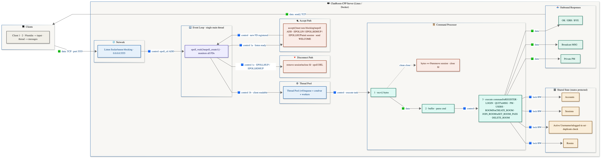

# ChatRoom-CPP



## Overview

`ChatRoom-CPP` is a multi-client chat application built to learn how network servers evolve from simple blocking designs into event-driven systems. The current project version implements a Linux `epoll`-based server, in-memory authentication, room-based messaging, private messaging, owner-controlled room management, and a cleaner terminal client for interactive testing.


## Features

- Multi-client TCP chat server in C++
- Linux non-blocking socket server using `epoll`
- Fixed-size worker thread pool for command processing
- Line-based command framing over TCP
- User registration and password-checked login
- Public and password-protected chat rooms
- Owner-only room controls with `SET_ROOM_PASS` and `DELETE_ROOM`
- Room broadcast messaging with `MSG`
- Direct private messaging with `PM`
- `USERS` view with registered-user `active` and `inactive` status
- `ROOMS` view with room visibility and `active` or `inactive` status
- Interactive terminal client with improved prompt and formatted output
- Docker workflow for running the Linux server from macOS

## Tech Stack

- Language: C++17
- Build: CMake
- Networking: POSIX sockets
- Event model: Linux `epoll`
- Concurrency: `std::thread`, mutexes, condition variables
- Runtime target: Linux
- macOS support: Docker for the real `epoll` server


### Core Server Flow

1. The server creates a listening socket on port `5555`.
2. The listening socket is switched to non-blocking mode.
3. The server creates an `epoll` instance and registers the listening socket.
4. New client connections are accepted and added to `epoll`.
5. When a client socket becomes readable, the event loop enqueues work in the thread pool.
6. Worker threads call `recv()`, append incoming bytes to that client's input buffer, and extract complete newline-terminated commands.
7. Commands such as `REGISTER`, `LOGIN`, `CREATE_ROOM`, `JOIN_ROOM`, `MSG`, `PM`, `USERS`, `ROOMS`, `SET_ROOM_PASS`, and `DELETE_ROOM` are executed against shared chat state.
8. The server sends direct replies, room broadcasts, or private messages back to connected clients.

## Project Structure

```text
ChatRoom-CPP/
├── client/
│   └── simple_client.cpp
├── src/
│   └── main.cpp
├── CMakeLists.txt
├── Dockerfile
├── docker-compose.yml
├── LEARNING_JOURNAL.md
├── PROJECT_CONTEXT.md
└── README.md
```

## Supported Commands

### Account Commands

- `REGISTER <username> <password>`
- `LOGIN <username> <password>`
- `USERS`

### Room Commands

- `CREATE_ROOM <room> <password_or_dash>`
- `JOIN_ROOM <room> <password_or_dash>`
- `ROOM_USERS`
- `ROOMS`
- `SET_ROOM_PASS <room> <new_password_or_dash>`
- `DELETE_ROOM <room>`

### Messaging Commands

- `MSG <text>`
- `PM <username> <text>`
- `QUIT`

## Example Protocol Flow

```text
REGISTER alice pass123
LOGIN alice pass123
CREATE_ROOM lobby -
MSG hello everyone
USERS
ROOMS
```

Possible server responses include:

```text
OK REGISTER alice
OK LOGIN alice
OK CREATE_ROOM lobby
MSG lobby alice hello everyone
USERS alice:active bob:inactive
ROOMS lobby:public:active team:protected:inactive
```

## How To Run

### Option 1: Run on Linux

Build the server and client:

```bash
g++ -std=c++17 -Wall -Wextra -Wpedantic -pthread src/main.cpp -o chat_server
g++ -std=c++17 -Wall -Wextra -Wpedantic -pthread client/simple_client.cpp -o simple_client
```

Run the server:

```bash
./chat_server
```

In another terminal, run the client:

```bash
./simple_client 127.0.0.1 5555
```

### Option 2: Run on macOS with Docker

This version uses Linux `epoll`, so the full server should be run inside Docker on macOS.

Build the image:

```bash
docker build -t chatroom-cpp .
```

Start the Linux container:

```bash
docker run --rm -it -p 5555:5555 -v "$PWD":/workspace chatroom-cpp
```

Inside the container:

```bash
cd /workspace
g++ -std=c++17 -Wall -Wextra -Wpedantic -pthread src/main.cpp -o chat_server
g++ -std=c++17 -Wall -Wextra -Wpedantic -pthread client/simple_client.cpp -o simple_client
./chat_server
```

Open another macOS terminal and connect to the same container:

```bash
docker ps
docker exec -it <container_id> bash
```

Then run the client:

```bash
cd /workspace
./simple_client 127.0.0.1 5555
```

Open additional terminals and repeat the `docker exec` step if you want multiple clients.

## Current Limitations

- State is in-memory only and does not survive restart
- Password hashing is production-grade
- Output handling still uses a simple `send()` path without robust partial-write buffering
- There are no moderator roles, kick/mute features, rate limiting, or persistence yet
- The real server path is Linux-only because it depends on `epoll`


## Future Improvements

- persistence for accounts and room metadata
- stronger output buffering and partial-write handling
- moderation features such as `KICK` and `MUTE`
- rate limiting and session cleanup
- logging, metrics, and benchmarking

## Author

Tanish Gupta
